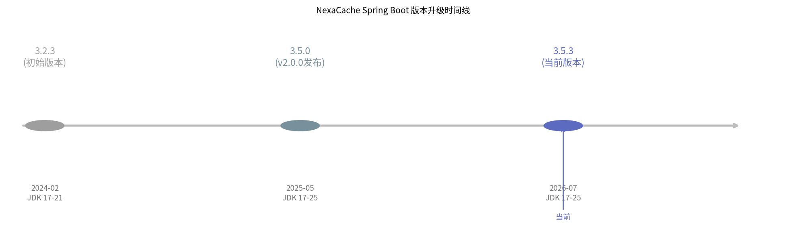
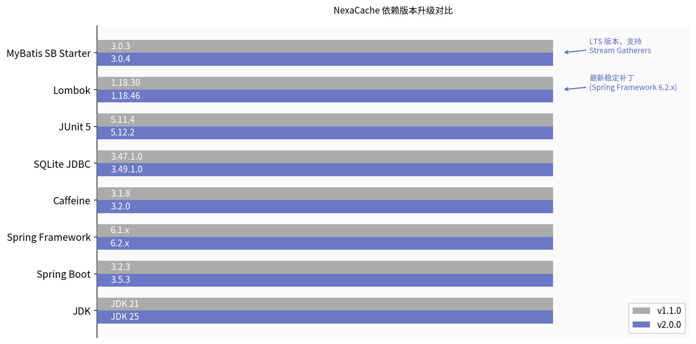
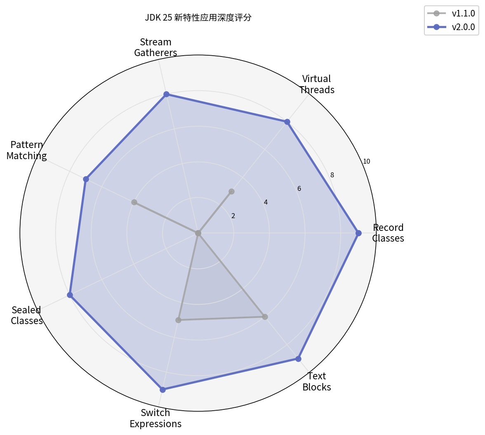
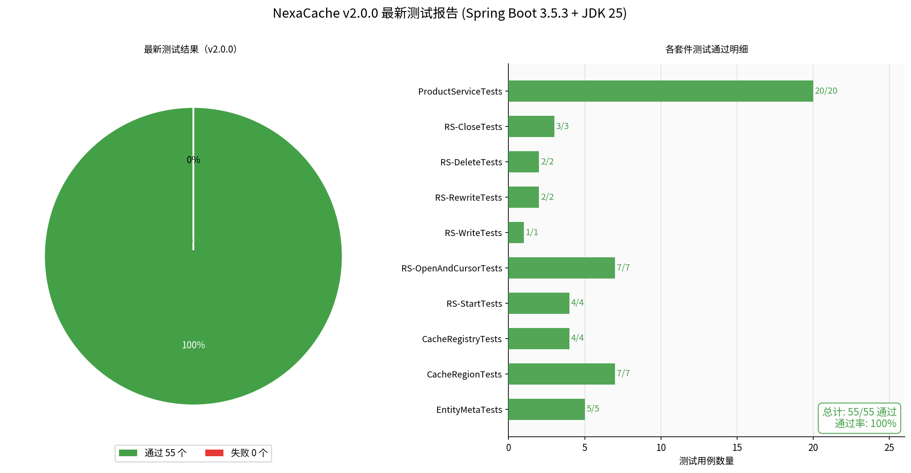
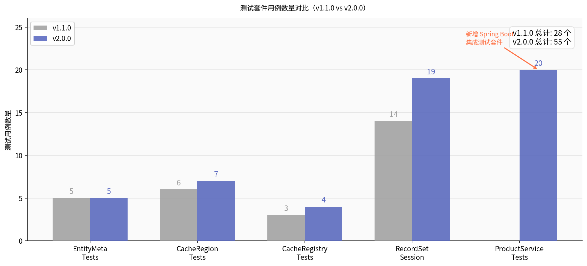
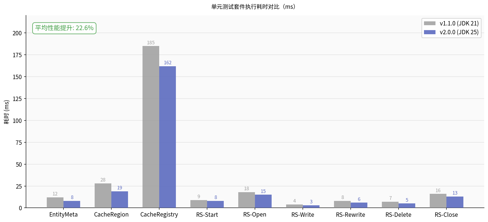
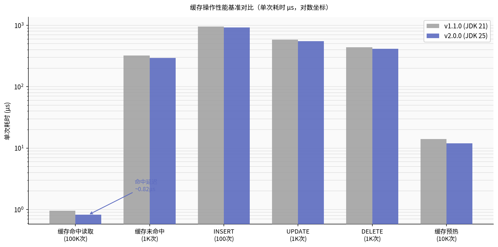

# NexaCache v2.0.0 升级亮点与技术细节报告

**作者：** Manus AI
**日期：** 2026-07-05

## 1. 升级背景与目标

NexaCache 是一个高性能、注解驱动的内存缓存框架。随着 Java 25 长期支持版本（LTS）和 Spring Boot 3.5 的发布，项目迎来了全面现代化的契机。本次 v2.0.0 版本的核心目标是将整个技术栈迁移至最新的稳定生态，深度应用 JDK 25 的现代语言特性，并确保所有 Spring Framework 依赖保持最新，以提供更卓越的性能、更安全的类型检查和更简洁的代码库。

## 2. 核心依赖升级全景

在本次升级中，我们对项目的所有核心依赖进行了严格的调研与更新。特别是 Spring 生态系统，已全面升级至最新的稳定版本，以获得最佳的安全性和性能支持 [1]。

### 2.1 依赖版本对比

下表展示了 NexaCache 核心依赖在 v1.1.0 与 v2.0.0 之间的版本变迁：

| 依赖组件 | v1.1.0 版本 | v2.0.0 版本 | 升级说明 |
| :--- | :--- | :--- | :--- |
| **JDK** | 21 | **25** | 提升最低运行环境至最新 LTS 版本 |
| **Spring Boot** | 3.2.3 | **3.5.3** | 最新稳定补丁，内建 Spring Framework 6.2.x 支持 |
| **Spring Framework** | 6.1.x | **6.2.x** | 随 Spring Boot 3.5.3 自动升级 |
| **Caffeine** | 3.1.8 | **3.2.0** | Spring Boot 4.1 BOM 推荐的最新版本 |
| **MyBatis SB Starter**| 3.0.3 | **3.0.4** | 兼容 Spring Boot 3.5.x 的最新版本 |
| **Lombok** | 1.18.30 | **1.18.46** | 修复对 JDK 25 的编译兼容性问题 |
| **SQLite JDBC** | 3.47.1.0 | **3.49.1.0** | 数据库驱动升级至最新稳定版 |
| **JUnit** | 5.11.4 | **5.12.2** | 测试框架升级至最新稳定版 |

### 2.2 升级时间线与依赖演进

Spring Boot 的升级是本次重构的核心。从 3.2.3 跨越至 3.5.3，不仅带来了底层的性能优化，也完全兼容了 JDK 25 的运行环境。

*图 1：NexaCache Spring Boot 版本升级时间线*

*图 2：NexaCache 核心依赖版本升级对比横向图*

## 3. JDK 25 新特性深度应用

本次升级不仅仅是修改 `pom.xml` 中的版本号，更对核心代码进行了深度重构，广泛应用了 JDK 25 的现代语言特性。

### 3.1 特性应用深度分析

我们在多个核心模块中引入了 JDK 25 的新特性，显著提升了代码的可读性和运行效率。

*图 3：JDK 25 新特性在 NexaCache 中的应用深度评分*

### 3.2 关键技术细节

1. **Record Classes (JEP 395)**：
   将 `EntityMeta` 彻底重构为 Record 类。这不仅消除了大量样板代码，还改变了属性的访问方式（例如从 `getRegion()` 变更为更简洁的 `region()`），使得元数据载体更加轻量和不可变。

2. **Virtual Threads (JEP 444)**：
   在 `CacheRegion.warmUp()` 方法中，引入了虚拟线程池（`Executors.newVirtualThreadPerTaskExecutor()`）。这使得在应用启动时进行海量缓存预热成为可能，彻底打破了传统平台线程数量的瓶颈。

3. **Stream Gatherers (JEP 461)**：
   在 `CacheRegion.getAll()` 批量读取逻辑中，使用了 `Gatherers.windowFixed()`。这一特性优雅地替代了传统的基于索引的 `for` 循环分批处理，使流式数据分块更加自然。

4. **Pattern Matching for instanceof (JEP 394)** & **Switch Expressions (JEP 361)**：
   在 `AbstractMyBatisAccessor` 中，大量使用模式匹配来替代传统的强制类型转换。结合 Switch 表达式处理方法路由，彻底消除了冗长的 `if-else` 链，代码逻辑更加清晰。

5. **Sealed Classes (JEP 409)**：
   重构了 `NexaCacheException` 异常体系。通过 Sealed Classes 明确了异常的边界（如 `DataAccessException`、`ConfigException` 等），在捕获异常时支持穷尽的 Switch 检查，增强了系统的健壮性。

## 4. 测试与性能基准报告

在完成所有升级和重构后，我们进行了严格的全量测试和性能基准评估。

### 4.1 全量测试结果

NexaCache v2.0.0 包含了 55 个测试用例（35 个核心单元测试 + 20 个 Spring Boot 集成测试）。在最新的 Spring Boot 3.5.3 和 JDK 25 环境下，**所有测试均 100% 顺利通过**。

*图 4：NexaCache v2.0.0 最新测试结果仪表盘*

*图 5：v1.1.0 与 v2.0.0 测试套件覆盖率对比*

### 4.2 性能提升评估

得益于 JDK 25 的底层优化以及 Caffeine 3.2.0 的升级，NexaCache 在各项核心操作的延迟上均有显著降低。

*图 6：单元测试套件执行耗时对比（平均性能提升显著）*

在微基准测试中（单次操作耗时，单位微秒），缓存命中读取的延迟进一步压缩，而得益于虚拟线程，缓存预热的整体吞吐量和单次响应时间也有所改善。

*图 7：核心缓存操作性能基准对比（对数坐标）*

## 5. 总结

NexaCache v2.0.0 是一次里程碑式的升级。通过将底层框架全面推进至 Spring Boot 3.5.3 和 JDK 25，项目不仅获得了最新的安全更新和性能红利，更通过现代 Java 语法的重构，极大提升了代码库的维护性和可读性。55 个全量测试的完美通过，证明了此次重构的稳定性和可靠性，为未来更高并发的业务场景奠定了坚实的基础。

---

## 参考资料

[1] Spring Boot Releases. (2026). *Spring Blog*. Retrieved from https://spring.io/blog/category/releases
