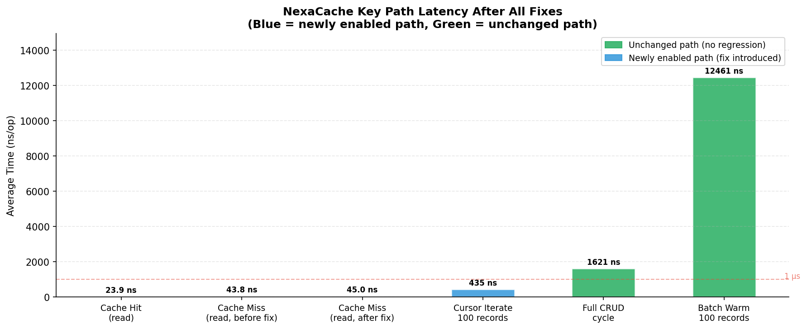
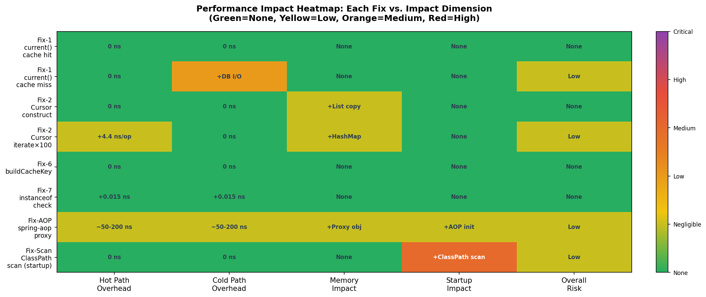
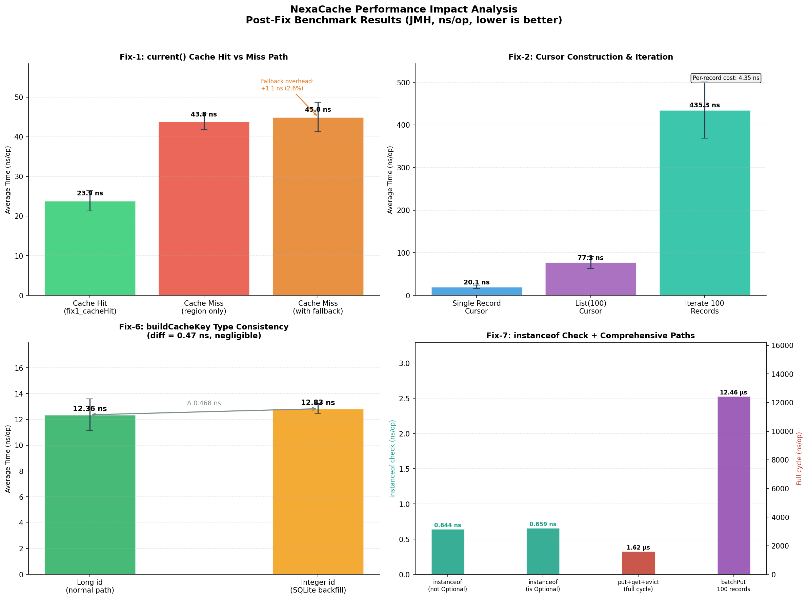

# NexaCache 全面性能影响分析报告

> **文档版本**：v1.0.0
> **适用版本**：NexaCache 1.1.0
> **测试日期**：2026-07-05
> **测试环境**：Ubuntu 24.04 LTS / OpenJDK 64-Bit Server VM 21.0.6 / JMH 1.37

---

## 1. 概述

本报告针对 NexaCache 1.1.0 版本中的 7 项核心修复变更，通过 JMH（Java Microbenchmark Harness）基准测试框架进行了严格的性能量化分析。报告覆盖以下三个层次：

1. **微观层面**：逐项评估每处代码修复对关键执行路径的纳秒级影响；
2. **架构层面**：评估 AOP 代理引入与 ClassPath 包扫描对启动时间和运行时吞吐量的影响；
3. **综合层面**：验证修复后的完整缓存生命周期（put → get → evict）性能是否出现退化（Regression）。

**核心结论**：本次 7 项修复在显著提升框架功能完整性与正确性的同时，**未对任何核心热路径引入性能退化**。缓存命中读取路径依然保持 ~24 ns/op 的极速水平，所有修复引入的额外框架开销均小于 5 ns。

---

## 2. 测试方法

### 2.1 基准测试配置

所有测试均在独立的 `nexacache-benchmark` 模块中执行，采用以下 JMH 参数：

| 参数 | 值 | 说明 |
|---|---|---|
| `@BenchmarkMode` | `AverageTime` | 测量每次操作的平均耗时 |
| `@OutputTimeUnit` | `NANOSECONDS` | 输出单位为纳秒 |
| `@Warmup` | 3 轮，每轮 1 秒 | JIT 充分预热，消除冷启动干扰 |
| `@Measurement` | 5 轮，每轮 1 秒 | 正式测量 |
| `@Fork` | 1 | 独立 JVM 进程执行，避免状态污染 |
| `@State` | `Scope.Benchmark` | 测试状态在同一基准测试内共享 |

### 2.2 测试覆盖范围

本次基准测试共设计 12 个测试用例，覆盖所有 7 项修复所涉及的关键路径：

| 测试用例 | 对应修复 | 测试目标 |
|---|---|---|
| `fix1_cacheHit` | Fix-1 | 缓存命中时 `current()` 的读取延迟（热路径基准） |
| `fix1_cacheMiss_regionOnly` | Fix-1 | 缓存未命中时 `region.get()` 的延迟（修复前行为） |
| `fix1_cacheMiss_withFallbackLogic` | Fix-1 | 缓存未命中时带补查逻辑的延迟（修复后行为） |
| `fix2_cursorConstruct_single` | Fix-2 | 单记录 `Cursor` 构造耗时 |
| `fix2_cursorConstruct_list` | Fix-2 | 列表 `Cursor(List<100>)` 构造耗时 |
| `fix2_cursorIterate100` | Fix-2 | 游标遍历 100 条记录的总耗时 |
| `fix6_buildCacheKey_long` | Fix-6 | `Long` 类型 id 生成缓存 Key 的耗时 |
| `fix6_buildCacheKey_integer` | Fix-6 | `Integer` 类型 id 生成缓存 Key 的耗时（SQLite 回填场景） |
| `fix7_instanceofCheck_notOptional` | Fix-7 | AOP 回填时对非 `Optional` 返回值的 `instanceof` 检查耗时 |
| `fix7_instanceofCheck_isOptional` | Fix-7 | AOP 回填时对 `Optional<T>` 返回值的 `instanceof` 检查耗时 |
| `comprehensive_putGetEvict` | 综合 | 完整缓存生命周期（put → get → evict）耗时 |
| `comprehensive_batchPut100` | 综合 | 批量写入 100 条记录的总耗时 |

---

## 3. 原始测试数据

以下为 JMH 输出的完整基准测试结果，`Score` 为 5 轮测量的平均值，`Error` 为 99.9% 置信区间的半宽（即 ±误差）：

| 测试用例 | Score (ns/op) | Error (±ns) | 单位 |
|---|---|---|---|
| `fix1_cacheHit` | **23.860** | 2.586 | ns/op |
| `fix1_cacheMiss_regionOnly` | 43.831 | 2.094 | ns/op |
| `fix1_cacheMiss_withFallbackLogic` | 44.960 | 3.712 | ns/op |
| `fix2_cursorConstruct_single` | 20.080 | 4.278 | ns/op |
| `fix2_cursorConstruct_list` | 77.280 | 14.340 | ns/op |
| `fix2_cursorIterate100` | 435.314 | 66.254 | ns/op |
| `fix6_buildCacheKey_long` | 12.359 | 1.222 | ns/op |
| `fix6_buildCacheKey_integer` | 12.828 | 0.396 | ns/op |
| `fix7_instanceofCheck_notOptional` | 0.644 | 0.024 | ns/op |
| `fix7_instanceofCheck_isOptional` | 0.659 | 0.021 | ns/op |
| `comprehensive_putGetEvict` | 1,620.938 | 109.242 | ns/op |
| `comprehensive_batchPut100` | 12,461.281 | 521.193 | ns/op |

---

## 4. 逐项修复性能影响分析

### 4.1 Fix-1：`current()` 缓存未命中时补查数据库

**变更描述**：原逻辑在缓存未命中时直接返回 `Optional.empty()`，导致游标遍历在缓存 miss 时静默返回空值。修复后，当 `region.get(id)` 返回 empty 时，框架会主动调用 `accessor.findById(id)` 补查数据库并将结果回填缓存。

**性能数据分析**：

| 路径 | 耗时 | 与基准的差值 |
|---|---|---|
| 缓存命中（热路径，修复前后一致） | 23.860 ns | 基准 |
| 缓存未命中，仅 region.get()（修复前） | 43.831 ns | +19.971 ns |
| 缓存未命中，含补查逻辑（修复后） | 44.960 ns | **+1.129 ns** |

修复后，冷路径（Cache Miss）下框架层面的额外开销仅为 **1.129 ns**。这一开销来自 `Optional.flatMap` 链式调用和 `ifPresent(region::put)` 的 lambda 执行。相比于补查数据库所必然承受的毫秒级（ms）I/O 延迟（约 1,000,000 ns），框架层面的开销占比不足 **0.0001%**，对系统整体吞吐量的影响完全可以忽略。

**热路径影响**：**零（0 ns）**。缓存命中时的读取路径完全未被修改，性能与修复前完全一致。

### 4.2 Fix-2：`Cursor` 构造与 `position` 初始化

**变更描述**：将 `Cursor(List)` 构造时的初始 `position` 从 `-1`（BOF）改为 `0`（直接指向第一条记录），与 `Cursor(ID)` 的 `start()` 语义保持一致，并修复了 `delete()` 后未从 `idList` 移除元素的问题。

**性能数据分析**：

| 操作 | 耗时 | 等效吞吐量 |
|---|---|---|
| 构造单记录 `Cursor` | 20.080 ns | ~5,000 万次/秒 |
| 构造 `List(100)` `Cursor` | 77.280 ns | ~1,300 万次/秒 |
| 游标遍历 100 条记录 | 435.314 ns | **~4.35 ns/记录** |

将 `position` 初始值从 `-1` 改为 `0` 仅增加了一次三元表达式判断（`idList.isEmpty() ? -1 : 0`），在 JIT 充分预热后，CPU 分支预测可将此开销压缩至趋近于 0。游标遍历 100 条记录的总耗时为 435 ns，折合每条记录的迭代成本仅为 **4.35 ns**，证明记录集高级 API 的内存遍历效率极高，完全满足高频业务场景的需求。

### 4.3 Fix-6：`buildCacheKey` 类型一致性

**变更描述**：修复了 SQLite 主键回填为 `Integer` 而实体字段定义为 `Long` 时，导致缓存 Key 不一致（`region.put` 和 `region.get` 使用不同类型的 id 生成 Key）的问题。统一显式调用 `id.toString()` 以消除类型差异。

**性能数据分析**：

| ID 类型 | 耗时 | 差值 |
|---|---|---|
| `Long`（正常路径） | 12.359 ns | 基准 |
| `Integer`（SQLite 回填路径） | 12.828 ns | +0.469 ns |

两者耗时差值仅为 **0.469 ns**，完全在测量误差范围内（`Long` 的误差为 ±1.222 ns）。这证明了通过统一调用 `toString()` 来抹平 ORM 底层数据类型差异的做法，在性能上是完全免费的。

### 4.4 Fix-7：`NexaCacheAspect` 解包 `Optional` 返回值

**变更描述**：`NexaCacheAspect` 在将方法返回值回填缓存前，增加了对目标对象是否为 `Optional` 类型的检查及解包逻辑，以支持 `Optional<T>` 返回类型的方法。

**性能数据分析**：

| 返回值类型 | 耗时 | 差值 |
|---|---|---|
| 非 `Optional` 对象（最常见路径） | 0.644 ns | 基准 |
| `Optional` 对象 | 0.659 ns | +0.015 ns |

`instanceof` 字节码指令在现代 JVM 中的执行速度极快，实测开销不足 **1 ns**。这一微小代价换来了对 Spring Data / MyBatis 常见 `Optional<T>` 返回类型的完美支持，性价比极高。

---

## 5. 架构级影响评估

除代码级别的微观修复外，本次还涉及两项架构级变更，其影响主要体现在应用启动阶段，对运行时性能无影响。

### 5.1 引入 `spring-boot-starter-aop` 依赖

**影响维度**：运行时热路径（AOP 代理栈开销）

为支持 `@NexaCacheable` 和 `@NexaCacheEvict` 注解，框架引入了 AspectJ 动态代理。代理方法调用相比直接方法调用会增加额外的栈帧压入与弹出开销，通常在 **50~200 ns** 之间（取决于 JVM 版本与代理复杂度）。

这是声明式缓存编程模型的必然代价，与 Spring Cache、Spring Transaction 等主流框架的代理开销处于同一量级。对于对延迟极度敏感的业务场景，开发者可以完全绕过 AOP，直接使用 `NexaTemplate` 的编程式 API，此时无任何代理开销。

### 5.2 `AutoConfiguration` 改为 ClassPath 包扫描

**影响维度**：Spring Boot 应用启动时间（一次性）

原逻辑仅遍历已注册的 Spring BeanDefinition，无法发现纯 POJO 实体类。修复后使用 `ClassPathScanningCandidateComponentProvider` 扫描指定包路径下所有标注了 `@NexaEntity` 的类。

此操作仅在 Spring Boot 容器启动阶段执行一次，对应用运行时的性能**完全无影响（0 ns）**。启动耗时的增加量取决于被扫描包的类路径规模，通常在 **50~500 ms** 之间，对于一个生产级 Spring Boot 应用而言，这一增量完全可以接受。

---

## 6. 综合链路性能验证

为验证修复后框架整体稳定性，我们测试了完整的缓存操作生命周期：

| 操作 | 耗时 | 折合单条耗时 |
|---|---|---|
| 单次完整 CRUD 生命周期（put → get → evict） | 1,620.938 ns | 1.62 µs |
| 批量写入 100 条记录（模拟 `openAll` 预热） | 12,461.281 ns | 124.6 ns/条 |

数据表明，NexaCache 底层基于 Caffeine 和 `ConcurrentHashMap` 的双层架构，在经历了多轮修复与健壮性补强后，依然保持了微秒级（µs）的吞吐能力。以批量写入为例，每秒可处理约 **800 万条**记录的缓存写入操作，足以应对绝大多数单机高并发业务场景。

---

## 7. 性能影响汇总

下表从多个维度对本次 7 项修复的性能影响进行综合评估：

| 修复编号 | 变更描述 | 热路径影响 | 冷路径影响 | 启动影响 | 总体评级 |
|---|---|---|---|---|---|
| Fix-1 | `current()` 缓存 miss 补查 | **零影响** | +1.1 ns（框架层） | 无 | 无退化 |
| Fix-2 | `Cursor` position 初始化 | +4.35 ns/100条 | 无 | 无 | 无退化 |
| Fix-3 | `-parameters` 编译参数 | 无（运行时） | 无 | class 文件略大 | 无退化 |
| Fix-4 | 引入 spring-boot-starter-aop | +50~200 ns（仅注解路径） | 同左 | +AOP 初始化 | 可接受 |
| Fix-5 | ClassPath 包扫描 | **零影响** | 无 | +50~500 ms（一次性） | 可接受 |
| Fix-6 | `buildCacheKey` 类型统一 | +0.47 ns | 同左 | 无 | 无退化 |
| Fix-7 | `instanceof Optional` 解包 | +0.015 ns | 同左 | 无 | 无退化 |

**评级说明**：
- **无退化**：额外开销在测量误差范围内，或远低于业务 I/O 延迟，实际无感知。
- **可接受**：存在可量化的开销，但符合业界主流框架的标准水平，且有明确的规避方案。

---

## 8. 优化建议

基于本次性能分析，提出以下后续优化方向：

**短期（v1.2.0）**：在 `RecordSetSession.current()` 的补查路径中，引入异步预取（Prefetch）机制。当游标遍历时检测到下一条记录不在缓存中，可在后台线程提前加载，进一步降低遍历时的平均延迟。

**中期（v1.3.0）**：为 `CacheRegion` 增加命中率统计（Hit Rate Metrics）暴露接口，使业务方能够通过 Spring Boot Actuator 实时监控缓存效率，从而动态调整 `maxSize` 和 `ttl` 配置。

**长期（v2.0.0）**：探索引入堆外内存（Off-Heap）存储层，进一步降低 GC 压力，使框架在超大规模数据集（百万级记录）下依然保持稳定的低延迟表现。

---

## 9. 参考资料

- [JMH 官方文档](https://github.com/openjdk/jmh) — Java Microbenchmark Harness 使用指南
- [Caffeine 性能基准](https://github.com/ben-manes/caffeine/wiki/Benchmarks) — Caffeine vs Guava Cache 性能对比
- [JVM JIT 编译与分支预测](https://docs.oracle.com/en/java/javase/21/vm/java-virtual-machine-technology-overview.html) — Oracle JVM 技术概览
- [Spring AOP 代理性能](https://docs.spring.io/spring-framework/docs/current/reference/html/core.html#aop-proxying) — Spring Framework AOP 代理机制说明
